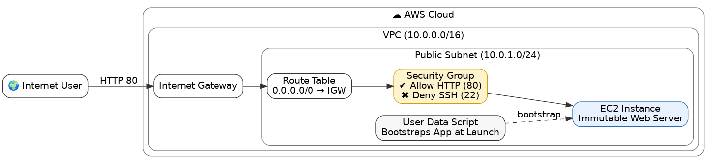

# ☁️ AWS Immutable Web Server

## 📌 Project Overview

This project provisions a **self-healing, immutable web server** on AWS using **Terraform**.
It follows the "Infrastructure as Code" pattern where servers are treated as **cattle, not pets** —
if something breaks, you destroy and recreate it instead of SSHing in to fix it.

The server runs **Nginx inside Docker** and is bootstrapped entirely via a `user_data` script (Cloud-Init).
There is **zero SSH access** by design.

## 🏗️ Architecture



### AWS Resources Created

| Resource               | Name                       | Purpose                                     |
|------------------------|----------------------------|---------------------------------------------|
| VPC                    | `immutable-vpc`            | Isolated network (`10.0.0.0/16`)            |
| Public Subnet          | `immutable-public-subnet`  | Hosts the EC2 instance (`10.0.1.0/24`)      |
| Internet Gateway       | `immutable-igw`            | Allows internet access for the VPC          |
| Route Table            | `immutable-public-rt`      | Routes `0.0.0.0/0` traffic through the IGW  |
| Security Group         | `immutable-web-sg`         | Allows only HTTP (port 80) inbound          |
| EC2 Instance           | `immutable-web-server`     | `t2.micro` running Ubuntu 22.04 LTS         |

---

## 📋 Prerequisites

Before you begin, make sure you have the following installed and configured:

### 1. AWS Account
- Sign up at [https://aws.amazon.com](https://aws.amazon.com)
- Keep your **AWS Account ID** handy

### 2. IAM User with Programmatic Access
1. Go to **AWS Console → IAM → Users → Add User**
2. Set a username (e.g., `terraform-admin`)
3. Attach the policy **`AdministratorAccess`** (or a custom policy with EC2, VPC, and SG permissions)
4. Create the user and **download the Access Key ID & Secret Access Key**

> [!CAUTION]
> Never commit your AWS credentials to Git. The `.gitignore` in this project already excludes `.tfvars` files.

### 3. AWS CLI
Install the AWS CLI for your OS:

```bash
# Windows (MSI Installer)
# Download from: https://awscli.amazonaws.com/AWSCLIV2.msi

# macOS
brew install awscli

# Linux
curl "https://awscli.amazonaws.com/awscli-exe-linux-x86_64.zip" -o "awscliv2.zip"
unzip awscliv2.zip
sudo ./aws/install
```

Verify installation:
```bash
aws --version
```

### 4. Configure AWS CLI

```bash
aws configure
```

You will be prompted for:
```
AWS Access Key ID:     <your-access-key>
AWS Secret Access Key: <your-secret-key>
Default region name:   ap-southeast-1
Default output format: json
```

> [!IMPORTANT]
> The region is set to `ap-southeast-1` (Singapore) in this project. If you change it in `aws configure`, you must also update it in `main.tf` (line 2).

Verify the connection:
```bash
aws sts get-caller-identity
```
You should see your Account ID, ARN, and User ID — this confirms AWS is connected.

### 5. Terraform

Install Terraform:

```bash
# Windows (Chocolatey)
choco install terraform

# Windows (Scoop)
scoop install terraform

# macOS
brew install terraform

# Linux
sudo apt-get update && sudo apt-get install -y gnupg software-properties-common
wget -O- https://apt.releases.hashicorp.com/gpg | gpg --dearmor | sudo tee /usr/share/keyrings/hashicorp-archive-keyring.gpg
echo "deb [signed-by=/usr/share/keyrings/hashicorp-archive-keyring.gpg] https://apt.releases.hashicorp.com $(lsb_release -cs) main" | sudo tee /etc/apt/sources.list.d/hashicorp.list
sudo apt update && sudo apt install terraform
```

Verify installation:
```bash
terraform -version
```

### 6. Git
```bash
git --version
```

---

## 📁 Project Structure

```
aws-immutable-webserver/
├── main.tf                    # All infrastructure (VPC, Subnet, IGW, SG, EC2)
├── variables.tf               # Input variables (currently empty, for future use)
├── outputs.tf                 # Outputs: server IP and website URL
├── provider.tf                # Provider config (currently empty, defined in main.tf)
├── scripts/
│   └── user_data.sh           # Bootstrap script: installs Docker & runs Nginx
├── modules/                   # For future modularization
├── immutable_web_server.png   # Architecture diagram
├── .gitignore                 # Ignores .terraform/, *.tfstate, *.tfvars, etc.
├── .terraform.lock.hcl        # Locked provider versions (AWS v6.32.1)
├── LICENSE                    # MIT License
└── README.md                  # You are here
```

---

## 🚀 Step-by-Step Deployment

### Step 1 — Clone the Repository

```bash
git clone <your-repo-url>
cd aws-immutable-webserver
```

### Step 2 — Initialize Terraform

This downloads the AWS provider plugin and sets up the working directory:

```bash
terraform init
```

Expected output:
```
Terraform has been successfully initialized!
```

### Step 3 — Preview the Infrastructure (Dry Run)

See exactly what Terraform will create **before** spending any money:

```bash
terraform plan
```

You should see **7 resources** to be created:
- `aws_vpc.main`
- `aws_subnet.public`
- `aws_internet_gateway.igw`
- `aws_route_table.public_rt`
- `aws_route_table_association.public_assoc`
- `aws_security_group.web_sg`
- `aws_instance.web_server`

### Step 4 — Deploy the Infrastructure

```bash
terraform apply
```

Terraform will show the plan again and ask for confirmation. Type **`yes`** to proceed.

> [!NOTE]
> This will create real AWS resources. A `t2.micro` instance is **free-tier eligible** for the first 12 months of your AWS account.

### Step 5 — Get the Server URL

After deployment, Terraform will print:

```
Outputs:

web_server_ip = "x.x.x.x"
website_url   = "http://x.x.x.x"
```

You can also retrieve these anytime with:
```bash
terraform output
```

### Step 6 — Verify the Deployment

1. **Open the URL** in your browser — you should see:
   > **"Automation Successful!"**
   > *This server was bootstrapped automatically using Terraform & User Data.*

2. **Wait 2–3 minutes** after `terraform apply` if the page doesn't load immediately — the `user_data.sh` script needs time to install Docker and start Nginx.

3. **Check from the terminal:**
   ```bash
   curl http://<your-server-ip>
   ```

---

## 🔄 How to Update the Server (Immutable Way)

Because this is an **immutable** server, you do **not** SSH in to make changes. Instead:

1. Edit `scripts/user_data.sh` with your changes
2. Run `terraform apply` again — Terraform will detect the change and **replace** the instance
3. A brand-new server spins up with the updated configuration

---

## 💣 Tear Down (Destroy All Resources)

When you're done, **destroy everything** to avoid charges:

```bash
terraform destroy
```

Type **`yes`** to confirm. This removes all 7 resources from your AWS account.

> [!WARNING]
> This action is irreversible. All data on the server will be lost.

---

## 🔐 Security Decisions

| Decision                  | Reason                                                        |
|---------------------------|---------------------------------------------------------------|
| **No SSH (Port 22)**      | Blocked by default — all config happens via `user_data.sh`    |
| **HTTP only (Port 80)**   | Only web traffic is allowed inbound                           |
| **All outbound allowed**  | Server can pull Docker images, OS updates, etc.               |
| **No key pair**           | No SSH key is created or attached to the instance              |
| **State files gitignored**| `.tfstate` files contain sensitive data and are never committed |

---

## 🛠️ Tech Stack

| Layer               | Technology                          |
|---------------------|-------------------------------------|
| **IaC**             | Terraform (AWS Provider v6.32.1)    |
| **Cloud**           | AWS (VPC, EC2, SG, IGW)            |
| **OS**              | Ubuntu 22.04 LTS (Jammy)           |
| **Containerization**| Docker CE                           |
| **Web Server**      | Nginx (Alpine image)               |
| **Config Mgmt**     | Bash / Cloud-Init (`user_data.sh`) |

---

## 🐛 Troubleshooting

| Problem                            | Solution                                                                                   |
|------------------------------------|--------------------------------------------------------------------------------------------|
| `terraform init` fails             | Check internet connection. Delete `.terraform/` folder and retry.                          |
| `terraform plan` shows errors      | Run `aws sts get-caller-identity` to verify AWS credentials are configured.                |
| Page doesn't load after apply      | Wait 2–3 minutes for `user_data.sh` to finish. Check the AWS Console → EC2 → System Log.  |
| `Error: No valid credential sources`| Run `aws configure` again and double-check your Access Key and Secret Key.                |
| Want to change the AWS region      | Update the `region` in `main.tf` line 2 **and** the `availability_zone` in `main.tf` line 17. |

---

## 📄 License

This project is licensed under the MIT License — see the [LICENSE](LICENSE) file for details.

---

**Author:** Marjan Rafi

